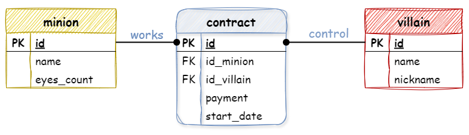

# Набор персонала


Проект создается со сборщиком Maven (в связи с тем, что в Университете не доступен сборщик gradle)

## Hibernate
Объектно-реляционное отображение (Object-Relational Mapping, ORM) — это процесс преобразования объектов Java в таблицы базы данных (нивелируя использование SQL).

Hibernate - это один из первых фреймворков (с 2001 года) реализующих ORM-подход взаимодействия с базами данных, который послужил источником вдохновения для Java (теперь Jakarta) Persistence API, или JPA, и включает в себя полную реализацию последней версии этой спецификации. Соответственно реализовывать свое решение можно как используя собственное API Hibernate (с использованием Session и SessionFactory), так и оставляя возможность переносимости на другие реализации JPA (с использованием EntityManager и EntityManagerFactory)[но смешивать не желательно]

## Взаимодействие через собственное API Hibernate:
- описать сущности предметной области, используя аннотации jakarta.persistence.* для предоставления информации о сопоставлении классов с сущностями и их связями в базе данных;
- настроить конфигурацию Hibernate с помощью файла hibernate.properties, расположенного в папке resources проекта;
- создать SessionFactory, используя загрузку встроенной конфигурации (на основе hibernate.properties), или настроить конфигурацию сессии программно;
- открывать сессию Session для сохранения и/или запроса данных (и обязательно закрыть после использования).

## Чтобы подключить Hibernate:
- подключить базовый модуль Hibernate;
- подключить JDBC-драйвер (в соответствии с СУБД);
- развернуть локально описанную базу данных (или изменить адрес и настройки подключения).

### Чтобы подключить основной модуль Hibernate 7.0.0.Alpha2 [или старшая версия]
* добавьте в файле-сборки pom.xml в список зависимостей:
```
<dependencies>
    <!-- Hibernate -->
    <dependency>
        <groupId>org.hibernate.orm</groupId>
        <artifactId>hibernate-core</artifactId>
        <version>7.0.0.Alpha2</version>
    </dependency>
</dependencies>
```

### Чтобы подключить JDBC-драйвер к проекту:
1) Через подключение библиотеки к проекту:
* File -> Project Structure -> Libraries
* На плюсе (+) выберите From Maven...
* В поиске найдите (search) драйвер, соответствующий вашей базе данных: org.postgresql:postgresql:42.7.3 [или старшая версия]
* И подтвердите подключение - ОК -> Apply

2) Или через файл-сборки:
* добавьте в файле-сборки pom.xml в список зависимостей:
```
<dependencies>
    <!-- PostgreSQL JDBC-driver -->
    <dependency>
        <groupId>org.postgresql</groupId>
        <artifactId>postgresql</artifactId>
        <version>42.7.3</version>
    </dependency>
</dependencies>
```
* И подтвердить загрузку библиотеки

### Чтобы развернуть резервную копию базы данных:
1) Резервная копия базы данных приложена в resources/head-hunter.sql
2) Подключитесь к локальному серверу PostgreSQL через PgAdmin (или терминал)
3) Создайте пустую базу данных rut_head_hunter
4) Восстановите в ней приложенную резервную копию базы данных

## Полезные ресурсы
* [Introductory guide to Hibernate ORM](http://docs.jboss.org/hibernate/orm/7.0/introduction/html_single/Hibernate_Introduction.html)
* [Hibernate Query Language Guide (HQL)](http://docs.jboss.org/hibernate/orm/7.0/querylanguage/html_single/Hibernate_Query_Language.html)
* [The Jakarta Persistence (3.2) JavaDocs](https://jakarta.ee/specifications/persistence/3.2/apidocs/)